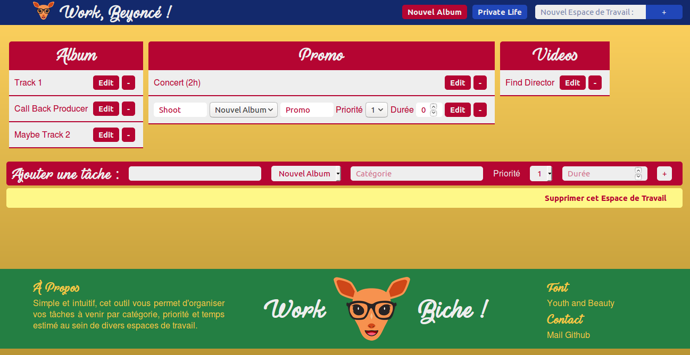

<h1>Work Biche!</h1>
<h2>Une To-Do List simple et intuitive.</h2>

  
  <wbr>
  Projet de mi-formation, cet outil permet d'organiser vos tâches à venir par catégorie, priorité et temps estimé au sein de divers espaces de travail. Simple et intuitif, les données sont stockées sur serveur à travers trois tables liées et dépendantes d'un compte utilisateur (authentification à deux facteurs). Espaces de travail et tâches peuvent être édités/supprimés par l'utilisateur à tout moment.
  <wbr>
  
  <wbr>
  <b>Codes utilisés</b> : HTML, Sass/CSS (responsive), PHP, SQL, AngularJS. Architecture MVC.
   
  <b>En cours</b> : UX amélioriée, ajout de nouvelles fonctions (rappel de la somme des tâches par espaces de travail).
   
  <b>Perspectives</b> : ajout d'un panneau pour organiser un "sprint" regroupant des tâches de différents espaces de travail.
   
  <a href="https://github.com/paulbhr/workbiche">Code source</a>

